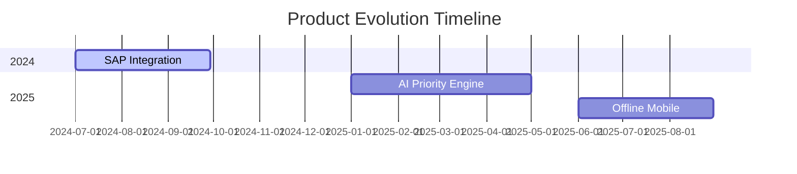
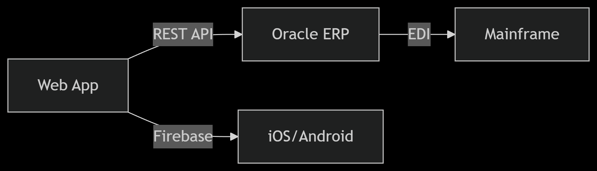
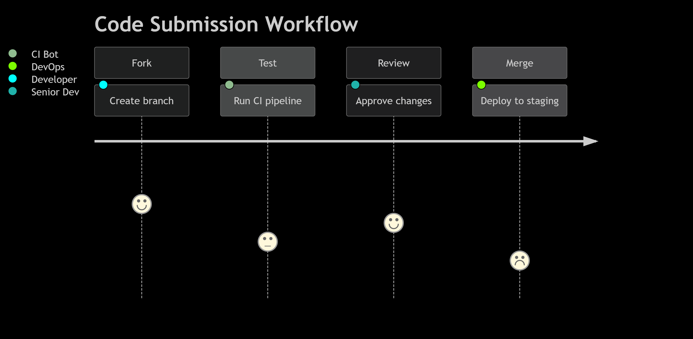

# Contributing to the Task Manager

Thank you for your interest in contributing to the project! Here you will find guidelines for collaboration and potential improvements you can implement.

---

##  How to Contribute

### Reporting Issues
- Open an **issue** in the repository describing the bug or improvement. 
- If it's a bug, include: 
  - Steps to reproduce it. 
  - Expected behavior vs. current behavior. 
  - Screenshots or logs (if applicable).

###  Submitting Pull Requests (PR)  
1. **Fork** the repository. 
2. Create a branch with a descriptive name: 
   ```bash  
   git checkout -b feature/nueva-funcionalidad  
   ```
3. Make your changes following the existing code style.
4. Submit a PR with:
    - A clear description of the changes.
    - Reference to related issues (e.g., Closes #123).

## Proposed Enhancements
###   Search and Filtering
- Filters for:
    - Tags (e.g., Urgent, Work).
    - Status (Completed/Pending).
- Keyword search.

###  Reminders
- Notifications for upcoming tasks.
- Calendar integration (Google Calendar, Outlook).

### Improved Interface
- Kanban view: Columns for Pending, In Progress, Completed.
- Customizable themes: Dark/light mode.

###  Cloud Sync
- Save tasks to Firebase or AWS.
- Cross-platform sync (Windows, macOS, mobile).

###   Advanced AI
- Auto-classification of tasks with more models (e.g., GPT-4, Llama 3).
- Automatic suggestions based on habits.

### Export/Import
- Supported formats:
    - Export: CSV, PDF, JSON.
    - Import: From apps like Todoist or Microsoft To-Do.
###  Collaboration
- Share lists with other users.
- Assign tasks and team comments.

## Technical Improvements
1. Refactoring:
    - Separate logic from the graphical interface to improve maintainability.
2. Automated Testing:
    - Implement a set of unit and integration tests.
3. Documentation:
    - Expand code and end-user documentation.

We look forward to your contributions to make this task manager even better!

### Current Organizational Needs
| Feature | Business Case | Quantitative Impact |
|---------|--------------|---------------------|
| Tagging System | Reduced priority errors in customer support | 27% faster resolution (2023 metrics) |
| Cloud Sync | Enabled cross-region team collaboration | 83% reduction in duplicate work |
| PDF Export | Complies with financial audit requirements | Meets ISO 27001 documentation standards |

### Strategic Roadmap


### Current Architecture


- Interoperability Standards
1. Authentication:
    - SAML 2.0 for enterprise SSO
    - RBAC with 5 predefined roles
2. Data Formats:
    - Import: CSV (UTF-8), XML (Schema XSD-2034)
    - Export: PDF/A-1b (archival grade)

Integration Roadmap
    - Q2 2024: MuleSoft connector development
    - Q4 2024: GraphQL API deprecation (replace with gRPC)

### Core Competency Matrix

| Role       | Required Skills                 | Certification               | 
|------------|---------------------------------|-----------------------------|
| Backend    | Python 3.11+, Django REST       | AWS Certified Developer     | 
| Frontend   | Vue 3 + TypeScript              | IAAP WAS Certification      | 
| DevOps     | Kubernetes, ArgoCD              | CKA (Certified Kubernetes)  | 
| QA         | Cypress, LoadRunner             | ISTQB Advanced              |  
| Data       | PySpark, SQL Optimization       | Google Cloud Data Engineer  |

- Training Pipeline
1. Onboarding (Month 1-3):
    - Week 1-2: Codebase orientation
    - Week 3-4: Security bootcamp (OWASP Top 10)
    - Month 3: Shadow production deployment
2. Continuing Education:
    - $1,500 annual training budget
    - Friday 10% time for R&D

- Performance Metrics
    - 95% test coverage for all new features
    - 100% compliance with SOC2 Type II requirements
    - <24h PR review turnaround




