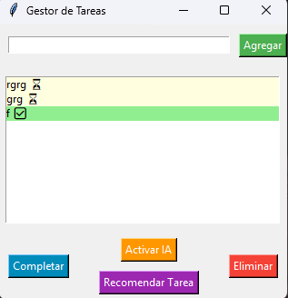

# 📝 AI-Powered Task Manager


An intuitive task manager with AI features for auto-tagging and smart recommendations.

---

##  Motivation


**Why this project?

**  
```markdown
- Automates task organization using AI (Ollama) for intelligent tagging.  
- Simplifies prioritization based on urgency and mood.  
- Ideal for users seeking productivity with minimalist tools.  
```

##   Requirements

- **Python 3.7+**  
- **Tkinter** (included in Python standard library)  
- **Ollama** (optional for AI):  
```bash
curl -fsSL https://ollama.ai/install.sh | sh
```

---
# Current Architecture


- Implemented Technologies

|Component|Technology/Standard	|Example Usage|
|------------------------|-------------------|--------------|
|Ollama AI	|HTTP API (Puerto 11434)	|POST /api/generate with JSON payload|
|Data Export		|CSV (RFC 4180)	|Excel/Sheets compatibility|
|Sync	|Webhooks	|Slack/MS Teams notifications|

Ollama API Example

``` bash
curl -X POST http://localhost:11434/api/generate \
  -H "Content-Type: application/json" \
  -d '{"model":"mistral", "prompt":"Clasifica: Preparar informe financiero"}'
```

Integration Roadmap

|Quarter	|Feature|Standard|
|------------------------|-------------------|--------------|
|Q3 2024		|Google Tasks API		|OAuth 2.0|
|Q4 2024		|CalDAV (Calendarios)		|iCalendar RFC 5545|
|Q1 2025		|Zapier/Integromat		|Webhooks JSON|

Contributor Requirements

   - For AI integrations:
   ```bash 
   ollama pull mistral  # Download language model
   ```

   - Para desarrollo de APIs:
   ``` python
   # Ejemplo: Extender la API
   # Example: API extension
   @app.route('/api/v1/tasks', methods=['GET'])
   def get_tasks():
    return jsonify(load_tasks())
   ```

##  Installation


1. Clone the repository:
   ```bash
   git clone https://github.com/samueljs2006/Proyecto-2-Un-software-para-la-transformaci-n-digital.git
   cd ai-task-manager  
   ```
2. Install dependencies:
    ```bash
    pip install tkinter
    ```

---

##  Deployment

### Windows
```bash
python task_manager.py
```
### Linux/macOS
```bash
chmod +x task_manager.py
python3 task_manager.py
```
### Docker (Opcional)
```markdown
```bash
docker build -t task-manager .
docker run -it --rm task-manager
```

---

##  Usage Examples

```markdown
1. **Add a task**:  
   - Type "Prepare monthly report" and click *Add*.  

2. **AI auto-tagging**:  
   - Click *Enable AI* → Tags as "Urgent" if the task contains keywords.  

3. **Recommendation**:  
   - Click *Recommend Task* → Suggests tasks tagged as "Urgent" first.  

4. **Complete/Delete**:  
   - Select a task and use the corresponding buttons.  
```
##  Capturas
| Main Interface	 | AI Recommendation |
|--------------------|---------------------|
|  |  |

##   Contributions
```markdown
1. Fork the project.  
2. Create a branch (`git checkout -b feature/new-feature`).  
3. Submit a PR with your changes.  
```
