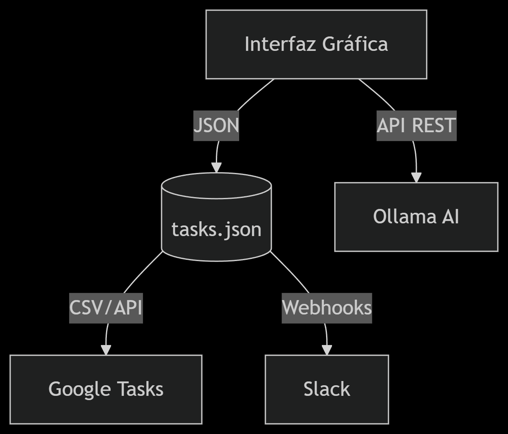

# 📝 Gestor de Tareas con IA


Un gestor de tareas intuitivo con funciones de IA para autoetiquetado y recomendaciones inteligentes.

---

##  Motivación


**¿Por qué este proyecto?**  
```markdown
- Automatiza la organización de tareas usando IA (Ollama) para etiquetado inteligente.  
- Simplifica la priorización basada en urgencia y estado de ánimo.  
- Ideal para usuarios que buscan productividad con herramientas minimalistas. 
```

##   Requisitos

- **Python 3.7+**  
- **Tkinter** (incluido en Python estándar)  
- **Ollama** (opcional para IA):  
```bash
curl -fsSL https://ollama.ai/install.sh | sh
```

---

## Arquitectura Actual


- Tecnologías y Protocolos
|Tecnologías y Protocolos|Tecnología/Estándar|Ejemplo de Uso|
|------------------------|-------------------|--------------|
|Ollama AI	|HTTP API (Puerto 11434)	|POST /api/generate con payload JSON|
|Exportación	|CSV (RFC 4180)	|Compatible con Excel/Google Sheets|
|Sincronización	|Webhooks	|Notificaciones a Slack/MS Teams|

Ejemplo de Llamada a la API de Ollama

``` bash
curl -X POST http://localhost:11434/api/generate \
  -H "Content-Type: application/json" \
  -d '{"model":"mistral", "prompt":"Clasifica: Preparar informe financiero"}'
```

Hoja de Ruta de Integraciones

|Trimestre|Función|Estándar Implementado|
|------------------------|-------------------|--------------|
|Q3 2024		|Google Tasks API		|OAuth 2.0|
|Q4 2024		|CalDAV (Calendarios)		|iCalendar RFC 5545|
|Q1 2025		|Zapier/Integromat		|Webhooks JSON|

Requisitos para Contribuir

   - Para integraciones con IA:
   ```bash 
   ollama pull mistral  # Descarga el modelo de lenguaje
   ```

   - Para desarrollo de APIs:
   ``` python
   # Ejemplo: Extender la API
   @app.route('/api/v1/tasks', methods=['GET'])
   def get_tasks():
    return jsonify(load_tasks())
   ```


##  Instalación


1. Clona el repositorio:
   ```bash
   git clone https://github.com/tu-usuario/gestor-tareas-ia.git
   cd gestor-tareas-ia
   ```
2. Instala dependencias:
    ```bash
    pip install tkinter
    pip install tkinterdnd2
    ```

---

## Despliegue

### Windows
```bash
python task_manager.py
```
### Linux/macOS
```bash
chmod +x task_manager.py
python3 task_manager.py
```
### Docker (Opcional)
```markdown
```bash
docker build -t task-manager .
docker run -it --rm task-manager
```

---

##  Ejemplos de Uso

```markdown
1. **Agregar tarea**:  
   - Escribe "Preparar informe mensual" y presiona *Agregar*.  

2. **Autoetiquetado con IA**:  
   - Haz clic en *Activar IA* → Etiqueta "Urgente" si la tarea contiene palabras clave.  

3. **Recomendación**:  
   - Presiona *Recomendar Tarea* → Sugiere tareas con etiqueta "Urgente" primero.  

4. **Completar/Eliminar**:  
   - Selecciona una tarea y usa los botones correspondientes.  
```
##  Capturas
| Interfaz Principal | Recomendación de IA |
|--------------------|---------------------|
|  |  |

##   Contribuciones

```markdown
1. Haz fork del proyecto.  
2. Crea una rama (`git checkout -b feature/nueva-funcion`).  
3. Envía un PR con tus cambios.   
```
