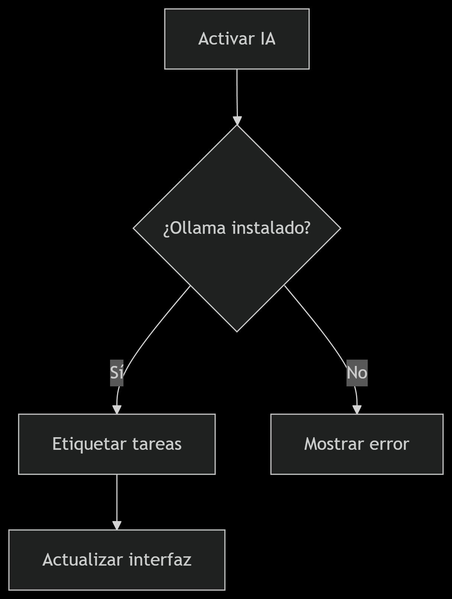

# Wiki y Devlog: Gestor de Tareas con IA

## Documentación para Desarrolladores

### Visión General
Aplicación de escritorio para gestión de tareas con:
- ✅ Crear/eliminar tareas  
- 🤖 Etiquetado automático con IA  
- 🔍 Recomendaciones inteligentes  

### Estructura del Proyecto
```bash
gestor_tareas/
├── tasks.json          # Base de datos de tareas
└── task_manager.py     # Lógica + interfaz gráfica
```
## 📦 Dependencias

### Esenciales
| Componente | Versión mínima | Instalación |
|------------|----------------|-------------|
| Python     | 3.7            | `sudo apt install python3` |
| Tkinter    | -              | Incluido en Python |
| ollama   | -              | opcional |

## 🔧 Configuración Rápida
1. Instalar Python 3.7+
``` bash
sudo apt-get install python3
```
2. Verificar Ollama (opcional):
```bash
ollama --version
```
## 🧠 Funciones Clave

### Gestión Básica
```python
def add_task():
    """Añade tarea con validación de campo vacío"""
    
def complete_task():
    """Marca tarea como ✅ completada"""
```
### Sistema de IA
```
graph TD
    A[Activar IA] --> B{¿Ollama instalado?}
    B -->|Sí| C[Etiquetar tareas]
    B -->|No| D[Mostrar error]
    C --> E[Actualizar interfaz]
```


### Algoritmo de Recomendación
1. Filtra tareas con tag "Urgente"
2. Ordena por antigüedad
3. Selecciona la más prioritaria

## 🖥️ Interfaz Gráfica
| Componente | Descripción | Color |
|------------|----------------|-------------|
| Lista de tarea| Muestra estado (✅/⏳) |Verde/Amarillo|
| Botón "Agregar"| Añade nueva tarea| #4CAF50 |
| Botón IA|Activa etiquetado automático	|#FF9800|

## 📅 Devlog

### v1.0 - Actual
- Funcionalidades básicas estables
- Integración Ollama básica
### Roadmap
- Soporte multi-usuario
- Sync en la nube
- Mejorar análisis de IA

## 🤝 Cómo Contribuir 
```bash 
git clone https://github.com/tu_repo/gestor_tareas.git
cd gestor_tareas
# Crear nueva rama:
git checkout -b mejora/descripcion_corta
```
📌 **Guía completa**: [CONTRIBUTING.md](/CONTRIBUTING.md)


